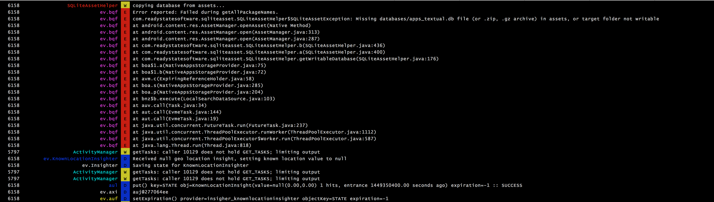
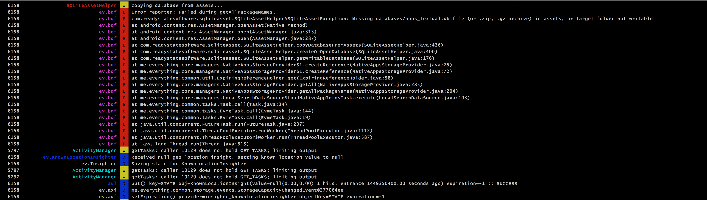
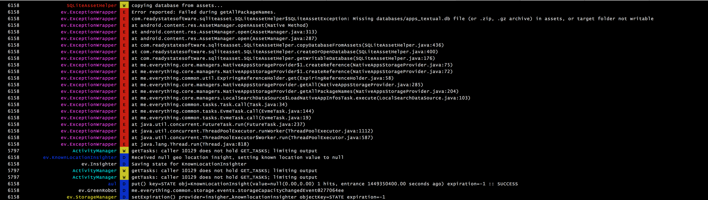

# recat
A colorful and highly configurable alternative to the `adb logcat` command from
the Android SDK with on the fly deobfuscation! (based on Marshall Culpepper's great [logcat-color](https://github.com/marshall/logcat-color)).

recat uses [pyretrace](https://github.com/EverythingMe/pyretrace) to deobfuscate logs.

**Note**: recat (logcat-color) is targetted at OS X and Linux, and does not currently
work in Windows.

[](https://badge.fury.io/py/recat-color)

# Installation

**Installation via pip** 

```bash
$ pip install recat-color
```

**Installation from source** (requires setuptools, may require sudo)

You can clone the recat git repository directly:

```bash
$ git clone https://github.com/EverythingMe/recat.git
```

To install logcat-color from the source directory, run:

```bash
$ sudo pip install .
```

or

```bash
$ sudo python setup.py install
```

## Examples

#### for logcat-color usage examples, configuration and profiles, go to (logcat-color's original [README](https://github.com/marshall/logcat-color/blob/master/README.md))

##Deobfuscation
**recat** retraces obfuscated logs using [pyretrace](https://github.com/EverythingMe/pyretrace), a python reimplementation on Proguard's Retrace, with a deobfuscation API for python.

When looking at logs from an obfuscated release build, trace messages are obfuscated too, here's a crash log from EverythingMe Launcher's release build:



Supplying a mapping file path as a command line argument will trigger the deobfuscation mechanism, causing every log line to go through pyretrace's deobfuscator.

```bash
$ recat -m path/to/mapping/file.txt
```

Same log, now with mapping file path added:



This will make the best effort to deobfuscate the 'message' in each line. 

### Deobfuscating tags
The following snippet is taken from [iosched](https://github.com/google/iosched/blob/master/android/src/main/java/com/google/samples/apps/iosched/util/LogUtils.java). It became a pretty popular strategy for log tag creation.

```java
    public static String makeLogTag(String str) {
        if (str.length() > MAX_LOG_TAG_LENGTH - LOG_PREFIX_LENGTH) {
            return LOG_PREFIX + str.substring(0, MAX_LOG_TAG_LENGTH - LOG_PREFIX_LENGTH - 1);
        }

        return LOG_PREFIX + str;
    }

    /**
     * Don't use this when obfuscating class names!
     */
    public static String makeLogTag(Class cls) {
        return makeLogTag(cls.getSimpleName());
    }
```

If you use this type of deobfuscation and wish to deobfuscate the tag as well, you must supply a prefix for your tags (i.e. `LOG_PREFIX`), here's an example:

EverythingMe Launcher used `ev.` as its base log prefix, adding `-t ev` will now deobfuscate the tags as well:

```bash
$ recat -m path/to/mapping/file.txt -t ev
```
Same output, now with deobfuscated tags:



## TODO - Mapping Fetcher

I also added a skeleton for a mapping file fetcher. It should auto download a mapping file from a file server by supplying a mapping file path template.
	
## Thanks

Thanks to [Marshall Culpepper](https://github.com/marshall) for the great [logcat-color](https://github.com/marshall/logcat-color). 
